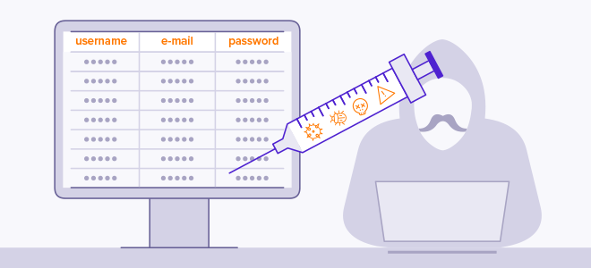

<div id="top"></div>
<!--
*** Thanks for checking out the Best-README-Template. If you have a suggestion
*** that would make this better, please fork the repo and create a pull request
*** or simply open an issue with the tag "enhancement".
*** Don't forget to give the project a star!
*** Thanks again! Now go create something AMAZING! :D
-->


<!-- PROJECT SHIELDS -->
<!--
*** I'm using markdown "reference style" links for readability.
*** Reference links are enclosed in brackets [ ] instead of parentheses ( ).
*** See the bottom of this document for the declaration of the reference variables
*** for contributors-url, forks-url, etc. This is an optional, concise syntax you may use.
*** https://www.markdownguide.org/basic-syntax/#reference-style-links
-->
[![Contributors][contributors-shield]][contributors-url]
[![Forks][forks-shield]][forks-url]
[![Stargazers][stars-shield]][stars-url]
[![Issues][issues-shield]][issues-url]
[![MIT License][license-shield]][license-url]


<!-- PROJECT LOGO -->
<br />
<div align="center">
  <a href="https://github.com/dudi709/SQL-injection-Final-Project">
    
  </a>

  <h3 align="center">Sql Injection Detection</h3>
</div>


<!-- TABLE OF CONTENTS -->
<details>
  <summary>Table of Contents</summary>
  <ol>
    <li>
      <a href="#about-the-project">About The Project</a>
      <ul>
        <li><a href="#built-with">Built With</a></li>
      </ul>
    </li>
    <li>
      <a href="#getting-started">Getting Started</a>
      <ul>
        <li><a href="#prerequisites">Prerequisites</a></li>
        <li><a href="#installation">Installation</a></li>
      </ul>
    </li>
    <li><a href="#usage">Usage</a></li>
    <li><a href="#license">License</a></li>
    <li><a href="#contact">Contact</a></li>
  </ol>
</details>


<!-- ABOUT THE PROJECT -->
## About The Project

<div align="center">
  <a href="https://github.com/dudi709/SQL-injection-Final-Project/blob/main/images/sqli_img.png">
    
  </a>
</div>

This project is a final project within the framework of a bachelor's degree in software engineering. First, we performed model training using machine learning libraries so that we could identify queries: malicious queries / plain queries and then we developed a web-dashboard app that displays data about queries using the model we trained.

* Malicious queries are queries whose content may contain text that could harm the database (SQL injection).
* Plain queries are queries without malicious targets.

<p align="right">(<a href="#top">back to top</a>)</p>


### Built With

* [Dash-Python](https://dash.plotly.com/)
* [Tensorflow](https://www.tensorflow.org/)
* [Keras](https://keras.io/)
* [Scikit-Learn](https://scikit-learn.org/stable/)
* [Pandas](https://pandas.pydata.org/)

<p align="right">(<a href="#top">back to top</a>)</p>


<!-- GETTING STARTED -->
## Getting Started

This is an example of how you may give instructions on setting up your project locally.
To get a local copy up and running follow these simple example steps.

### Prerequisites

For training the model: (You can use our pre-trained model which is in the model folder)
  ```sh
  pip install nltk==3.5
  pip install pandas==1.0.5
  pip install numpy==1.19.5
  pip install tensorflow==2.5.0
  pip install keras==2.6.0
  pip install scikit-learn==0.23.1
  ```
 For running app.py file (dashboard application):
   ```sh
  pip install nltk==3.5
  pip install dash==0.30.0
  pip install pandas==1.0.5
  pip install tensorflow==2.5.0
  pip install dash-bootstrap-components==1.0.0
  ```

### Installation

We recommend working with a conda virtual environment to install the libraries but this is at your discretion.

1. Clone the repo
   ```sh
   git clone https://github.com/dudi709/SQL-injection-Final-Project.git
   ```
2. Install the packages above

3. Run `app.py`

<p align="right">(<a href="#top">back to top</a>)</p>


<!-- USAGE EXAMPLES -->
## Usage

![App Demo][usage-app-demo]
When the application is running you can see it [HERE](http://127.0.0.1:8050/).

<p align="right">(<a href="#top">back to top</a>)</p>


<!-- LICENSE -->
## License

Distributed under the MIT License. See `LICENSE.txt` for more information.

<p align="right">(<a href="#top">back to top</a>)</p>


<!-- CONTACT -->
## Contact

Dudi Biton - dudi709@gmail.com </br>
Avihay Maman - avihaymaman1234@gmail.com

Project Link: [Github](https://github.com/dudi709/SQL-injection-Final-Project )

<p align="right">(<a href="#top">back to top</a>)</p>


<!-- MARKDOWN LINKS & IMAGES -->
<!-- https://www.markdownguide.org/basic-syntax/#reference-style-links -->
[contributors-shield]: https://img.shields.io/github/contributors/dudi709/SQL-injection-Final-Project?style=for-the-badge
[contributors-url]: https://github.com/dudi709/SQL-injection-Final-Project/graphs/contributors
[forks-shield]: https://img.shields.io/github/forks/dudi709/SQL-injection-Final-Project?style=for-the-badge
[forks-url]: https://github.com/dudi709/SQL-injection-Final-Project/network/members
[stars-shield]: https://img.shields.io/github/stars/dudi709/SQL-injection-Final-Project?style=for-the-badge
[stars-url]: https://github.com/dudi709/SQL-injection-Final-Project/stargazers
[issues-shield]: https://img.shields.io/github/issues/dudi709/SQL-injection-Final-Project?style=for-the-badge
[issues-url]: https://github.com/dudi709/SQL-injection-Final-Project/issues
[license-shield]: https://img.shields.io/github/license/dudi709/SQL-injection-Final-Project?style=for-the-badge
[license-url]: https://github.com/dudi709/SQL-injection-Final-Project/blob/master/LICENSE.txt
[usage-app-demo]: images/app_demo.jpg
